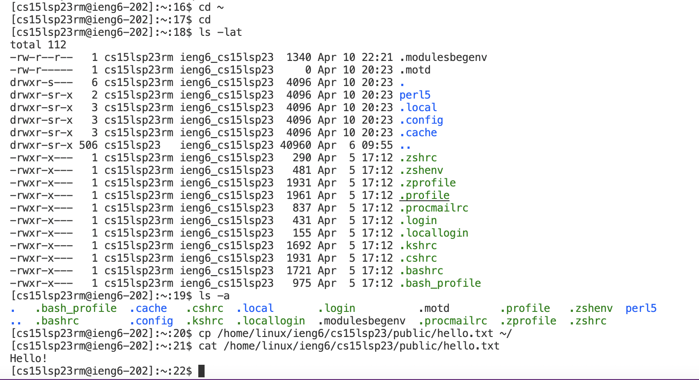

# CSE 15L Lab Report 1: Remote Access and FileSystem
## Installing VScode
(If you choose to use a computer in the lab, you may skip the installation and simply open Visual Studio Code on a lab computer.) 

**Visual Studio Code** is a code editor we will be used in future CSE15L labs. Go to [VS Code Website](https://code.visualstudio.com/) and choose the version that is right for your operating systems (i.e macOS for Macs, Windows for PCs). Follow steps in the downloaded package to install VS Code on your computer.

After installing the VS Code successfully on your computer, you are now able to open it and should see an opening window like this:


Now you are ready to connect your own device to the remote server!

## Remotely Connecting
(If you use a Windows system, install `git` on [Git for Windows](https://gitforwindows.org/). After installation, follow this [instruction](https://stackoverflow.com/questions/42606837/how-do-i-use-bash-on-windows-from-the-visual-studio-code-integrated-terminal/50527994#50527994) to set up your VS Code terminal with `git bash`.)

Look up and set new password for your student account for the course CSE 15L with Username and Student ID through [UCSD Educational Technology Services](https://sdacs.ucsd.edu/~icc/index.php). Follow this [tutorial](https://docs.google.com/document/d/1hs7CyQeh-MdUfM9uv99i8tqfneos6Y8bDU0uhn1wqho/edit) if you get stucked.

Open a terminal by clicking *Terminal* -> *New Terminal* in the VS Code menu bar to utilize `ssh`. Type in a command in this format (replace `<account>` with your specific course account):
```
$ ssh <account>@ieng6.ucsd.edu
```
If it is your first time connecting to this remote server, you will get a message asking for your intent to continue connecting. Type in `yes`, press enter, and type in your account password to continue. Otherwise, you only need to type in your password. (The password stays invisible when you type.) Once you log into the remote server successfully, which means the connection from your own device to the remote server completes, you will see something like this in your VS Code terminal:


Now you are ready to try out some commands!

## Trying Commands 
It is time to try different commands you have learned from Week 1 lectures. Either type in commands directly to run code on your computer or type commands after ssh-ing to run code on the remote server. 

Command list to try:
- `cd ~`: this command changes the current/working directory to your account's home directory.
- `cd`: this command has the same function as `cd ~`(if you would like to changes the current working directory to a specified directory path/folder, use `cd <directory name>` instead).
- `ls -lat`: this command lists all directories/folders and files in a directory and provides detailed information for each in an order by modification time (from latest to oldest).
- `ls -a`: this command lists all directories/folders and files, including all hidden files, in a directory
- `cp /home/linux/ieng6/cs15lsp23/public/hello.txt ~/`: this command makes a copy of the file "hello.txt" from the directory "/home/linux/ieng6/cs15lsp23/public/" to your account's home directory.
- `cat /home/linux/ieng6/cs15lsp23/public/hello.txt`: this command displays all contents of the file "hello.txt" located in the directory "/home/linux/ieng6/cs15lsp23/public/".

The screenshot below shows expected outputs from these useful commands. Try it on your VS Code terminal to see if you get similar ones: 



Try your best to explain how these commands work to produce a certain output (or produce errors). \
Hint: Some commands will not work properly if you are on a wrong account, such as your UCSD official account.

When you finish all above steps, you should log out the remote server by running `exit` command in your terminal.

**Congratulations on finishing CSE 15L Lab 1!**
