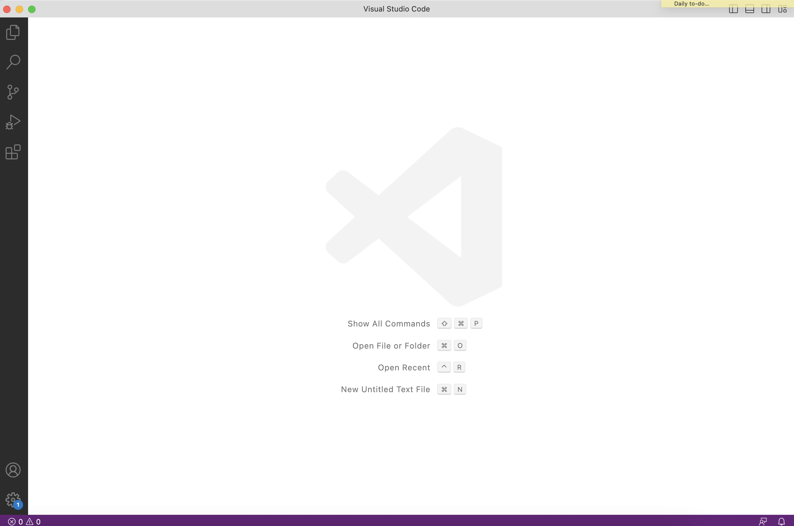

# CSE 15L Lab Report 1
## Installing VScode
(If you choose to use a computer in the lab, you may skip the installation and simply open Visual Studio Code on a lab computer.) 

**Visual Studio Code** is a code editor we will be used in future CSE15L labs. Go to [VS Code Website](https://code.visualstudio.com/) and follow the instruction on the website. Choose the version that is right for your operating systems (i.e macOS for Macs, Windows for PCs). Follow steps in the downloaded package to install VS Code on your computer.

After installing the VS Code successfully on your computer, you are now able to open it and should see a window like this:



Now you are ready to connect your own device to the remote server!

## Remotely Connecting
(If you use a Windows system, install `git` on [Git for Windows](https://gitforwindows.org/). After installation, follow this [Instruction](https://stackoverflow.com/questions/42606837/how-do-i-use-bash-on-windows-from-the-visual-studio-code-integrated-terminal/50527994#50527994) to set up your VS Code terminal with `git bash`.)

Look up and set up new password for your student account for the course CSE 15L with Username and Student ID through [UCSD Educational Technology Services](https://sdacs.ucsd.edu/~icc/index.php).

Open a terminal by clicking `Terminal` -> `New Terminal` in the menu bar to utilize `ssh`, the Secure Shell. Type in a command like this (replace xx with your specific course account):
```
$ ssh cs15lsp23xx@ieng6.ucsd.edu
```
If it is your first time connecting to this remote server, you will get a message asking for your intent to continue connecting. Type in `yes`, press enter, and type in your account password to continue. Otherwise, you only need to type in your password. (The password stays invisible when you type.) Once you log in the remote server successfully, which means the connection from your own device to the remote server completes, you will see something like this in your VS Code Terminal:


Now you are ready to try out some commands!
## Trying Commands 

