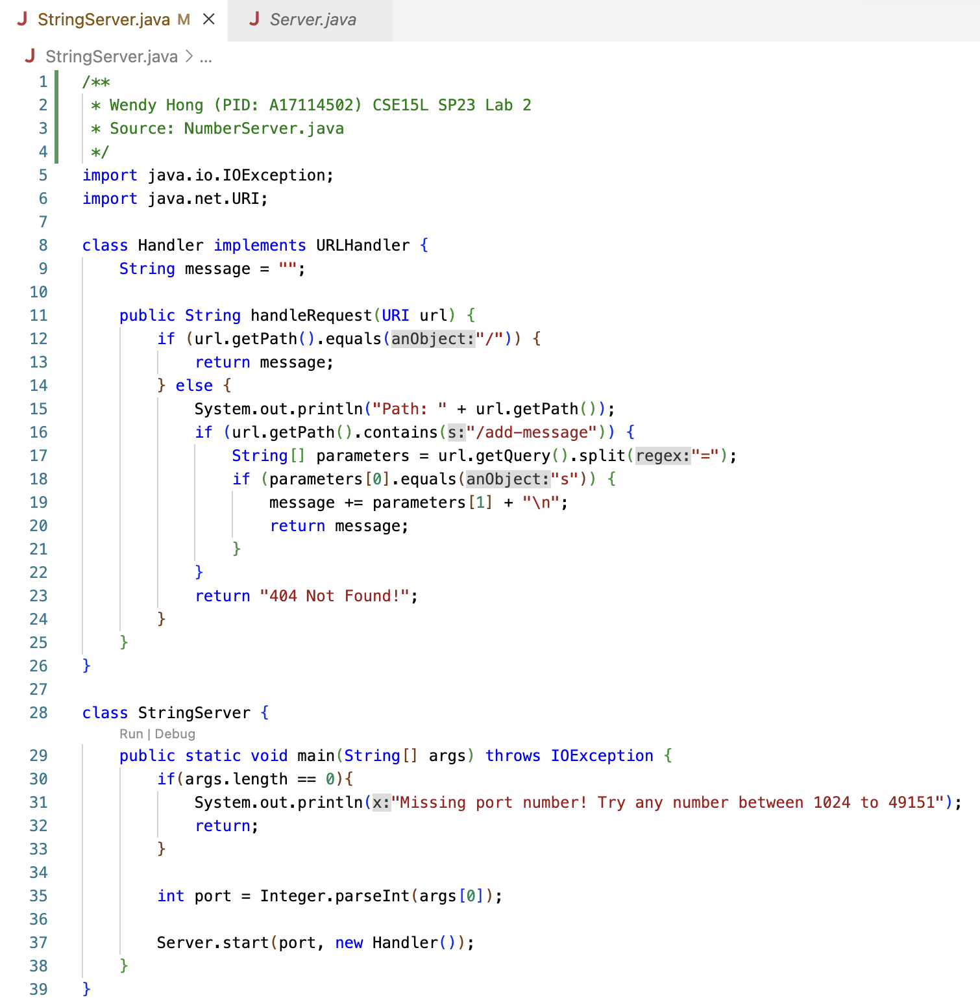
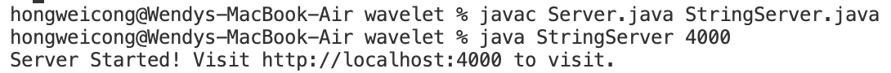
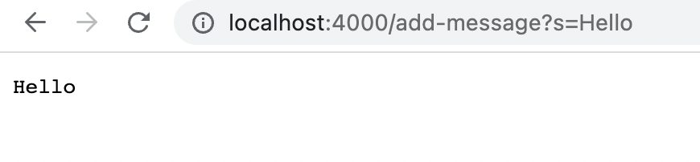
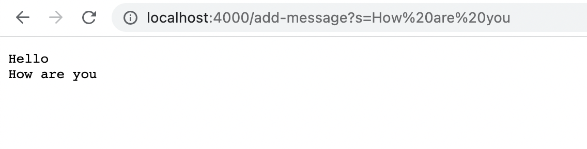
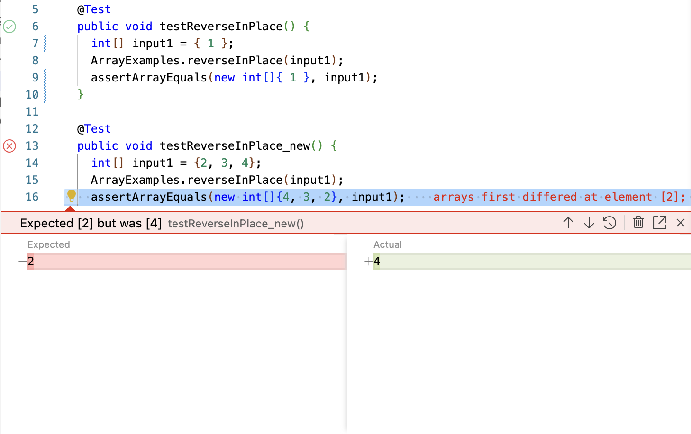

# CSE 15L Lab Report 2: Servers and Bugs
## Part 1: Web Server
To build a web server called `StringServer` that keeps track and add a single string to the server's string message by incoming requests of `/add-message?s=<string>`, we need to first create a new java file in the working directory of the clone of the repository [wavelet](https://github.com/ucsd-cse15l-f22/wavelet). This file should contains a class `Handler` that implements the interface `URLHandler` and a class `StringServer` to initiate the a new `Handler` object with a certain port number. 

The code for **StringServer.java** would look like this (I used NumberServer.java from CSE15L lab 2 class activity as a reference source): 


To run the server on a local computer, we may use the following commands from the current directory of the repository clone in the terminal:
```
javac Server.java StringServer.java 
java StringServer 4000
```
(Note that 4000 is a random port number that you may replace. A port number is any number between 1024 to 49151.)

If both commands run successfully, it would provide a link of the server for you to visit and put in requests.


To access the server, open the link it provides with the add-message requests in a browser. For example, try to load the following link in a browser:
-  `http://localhost:4000/add-message?s=Hello`

The methods in my code get called is the main method from the `StringServer` class since I am accessing the server for the first time. The relative argument here is the port number 4000, and the integer `port` has been initiated. As the main method get called, it initiates a `Handler` object and calls the `handleRequest` method under the `Handler` class. The string message, which is empty now, is concatenated with the input request string `"Hello"` and a new line (`"\n"` in code).
-  `http://localhost:4000/add-message?s=How are you`

The methods in my code get called this time is the `handleRequest` method under the `Handler` class. The string message, which contains `"Hello" + "\n"` at this point, is concatenated with the input request string `"How are you"` and a new line (`"\n"` in code).

At the end, type `ctrl + c` in the terminal to exit the server.
## Part 2: Bugs
The provided buggy method is:
```
static void reverseInPlace(int[] arr) {
    for(int i = 0; i < arr.length; i += 1) {
      arr[i] = arr[arr.length - i - 1];
    }
  }
```

One of the failure-inducing inputs for the buggy program is:
```
@Test
 public void testReverseInPlace_new() {
   int[] input1 = {2, 3, 4};
   ArrayExamples.reverseInPlace(input1);
   assertArrayEquals(new int[]{4, 3, 2}, input1);
 }
```

An input that doesn't induce a failure is:
```
@Test 
	public void testReverseInPlace() {
    int[] input1 = { 1 };
    ArrayExamples.reverseInPlace(input1);
    assertArrayEquals(new int[]{ 1 }, input1);
	}
```

The symptom is that arr after reverseInPlace() would equals {4, 3, 4} instead of {4, 3, 2} as expected (see screenshots below).


The bugs here are:
- should set up temporary variable to store the value
- should be i < arr.length/2 in the condition for the for loop

The revised version of the method should be:
```
static void reverseInPlace(int[] arr) {
    for(int i = 0; i < arr.length/2; i += 1) {
      int temp = arr[i];
      arr[i] = arr[arr.length - i - 1];
      arr[arr.length - i - 1] = temp;
    }
 }
 ```
## Part 3: What I have learned from week 2-3 labs?
Through labs from week 2 and 3, I have learned about how to build and run a basic web server as well as the process of debuging. I get to know not only components in an URL but also the concepts in bugs, such as failure-induced input, symptoms, etc. I think these skills would help me a lot in the future program development in that I am able to build and debug a program in a more logical way.
