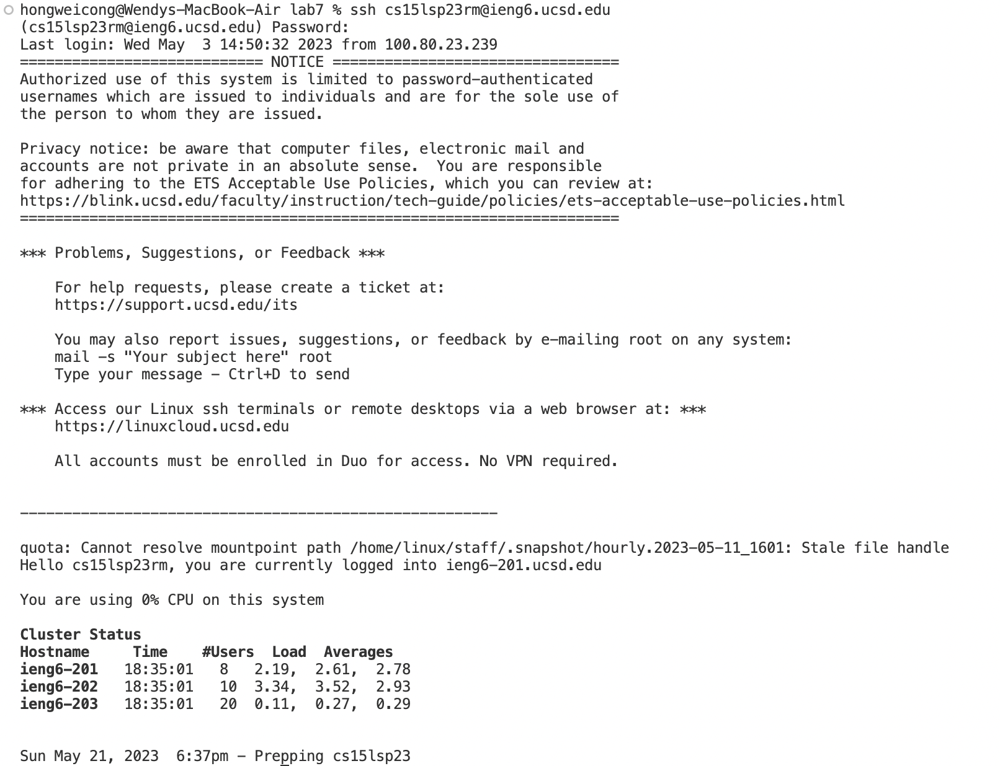
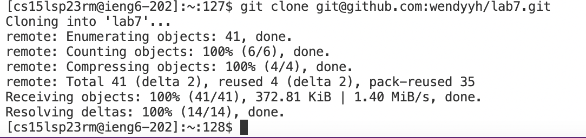
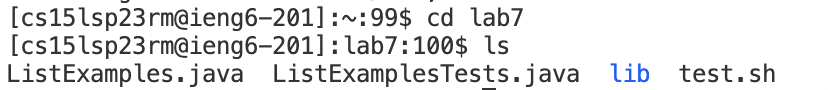
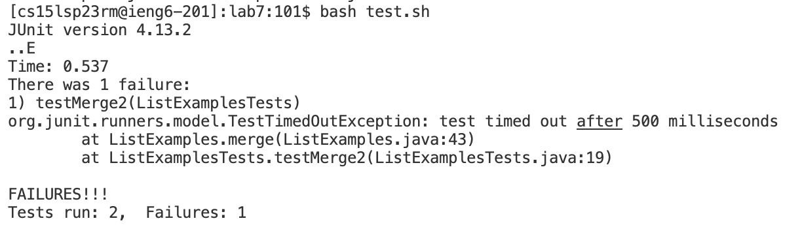
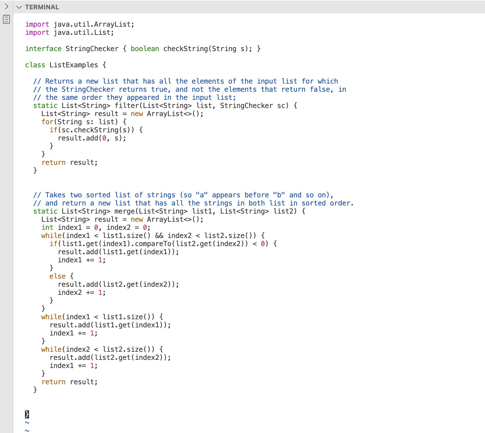
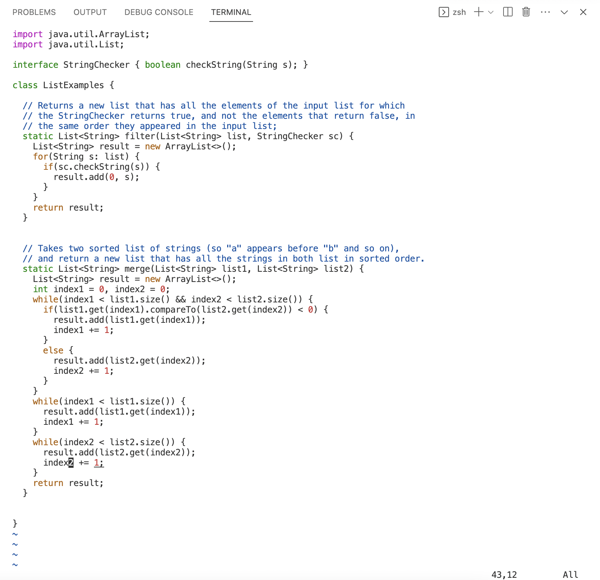
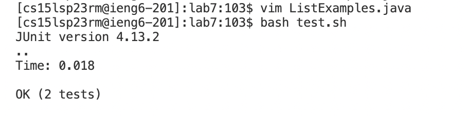
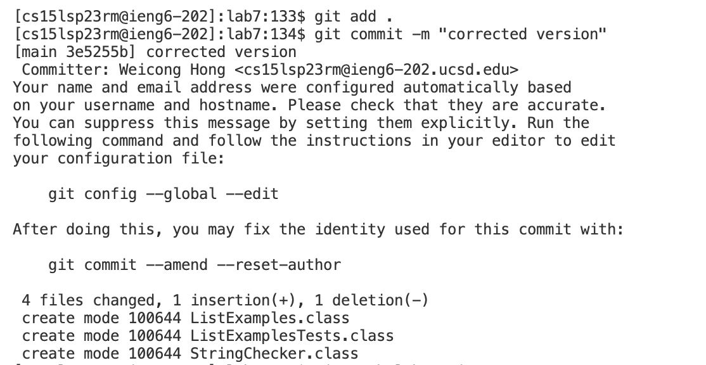
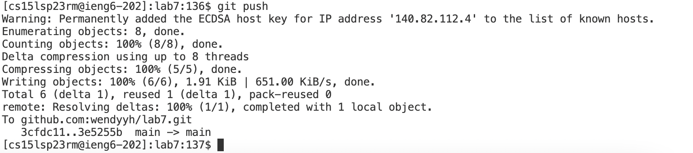

# CSE 15L Lab Report 4: Command Line Tasks
This lab report will demonstrate the process of completing the command line tasks from [CSE 15L week 7 lab](https://ucsd-cse15l-s23.github.io/week/week7/#lab-tasks---doing-it-all-from-the-command-line) with the repository [lab7](https://github.com/ucsd-cse15l-s23/lab7) (fork it before starting all tasks) in the terminal.

## Step 1: Log into ieng6
The first step is to use command `ssh` to log into our course specific ieng6 account. The keys pressed are:
`ssh<space><ieng6 course specific account><enter>`. Then type in the password (note that the keys pressed at this phase stay invisible for privacy): `<password><enter>`.

After successful log-in, the output would be like this:

## Step 2: Clone your fork of the repository from your Github account
In this step, we are going to clone the fork of the repository [lab7](https://github.com/ucsd-cse15l-s23/lab7) from our own Github account. Use the **SSH url** from our own fork of the repository for `git clone`. The keys pressed are: `git<space>clone<space><the forked repo's ssh url><enter>`. 

After a successful cloning of fork, the output would be like this:

## Step 3: Run the tests, demonstrating that they fail
To run the tests, we need to first change current directory to lab7 in our remote server. The keys pressed are: `cd<space>lab7<enter>`. Then we can use key `ls<enter>` to check the files/directories in `/lab7`. The output is:

We see that there is a `test.sh` file that we can use the `bash` command to run a series of commands that has been already given in the file to test the code. Then we can press keys `bash<space>test.sh<enter>` to run the tests for the java file `ListExamples.java`. The output demonstrates that there is 1 failure of 2 tests from `ListExamplesTests.java`:

## Step 4: Edit the code file to fix the failing test
In this step, we need to edit `ListExamples.java` to fix the failing test. We have been informed that the error in the code is just that index1 is used instead of index2 in the final loop in merge.

To edit the code file directly through commands, we utilize Vim Editor. We press on keys `vim<space>ListExamples.java<enter>` to open `ListExamples.java` in the terminal. We see that the error part, character '1' in the variable `index1` in the final loop in the method merge, is located near the bottom of the file. Therefore, we can use the capital `<G>` as a key to navigate to the bottom line of the java file (by pressing `<shift>` with character `<g>` together. Below is a screenshot of where we are at after navigating to the bottom line:

Since Vim Editor has a series of key assignment to various functions, we may use the direction keys (`<h>` for left, `<j>` for down, `<k>` for up, and `<l>` for right) to naviagte to the place we want to make changes in the code file. To access the error part, the keys pressed are `<kkkkkklllllllllll>`, through which we move upward 6 lines and rightward 11 spaces. To edit the code, we need to replace '1' with `2` in the variable `index1`. In Vim Editor, the key `x` can be used to delete a character at the cursor type, and the key `i` can be used to insert characters before the cursor. Using key `i` will trigger the INSERT MODE in the editor, and we need to use the escape key `<esc>` to go back to the NORMAL MODE. Therefore, the keys pressed should be `xi2<esc>`. The correct version of code file should be:

Now, we can save the code file and exit the editor through command `:wq`. The keys pressed are: `:wq<enter>`. After the execution of this command, we go back to the terminal with `ListExamples.java` updated.

## Step 5: Run the tests, demonstrating that they now succeed
To run the tests again, we repeat the necessary steps from **Step 3**. We have two ways to do so:
- We can press keys `bash<space>test.sh<enter>` to run the tests for the java file `ListExamples.java` once again;
- Or we can use keys `<up><up><enter>` to trace back the command history and run the command `bash test.sh` once again.
The output demonstrates that we now pass both 2 tests from `ListExamplesTests.java`:

## Step 6: Commit and push the resulting change to your Github account
The final step is to commit and push the resulting change to your Github account. We need to first stage the changes via the `git add` command. To stage all files, we press keys `git<space>add<space>.<enter>`. Then we commit the change and summarize the resulting change by the `git commit -m` command. The keys pressed should be: `git<space>commit<space>-m<space><"><description of the change><"><enter>`. If staging and commiting correctly, we would see outputs like these:

Finally, we push the committed changes to our Github account by the `git push` command. The keys pressed are: `git<space>push<space>`. (Note that we do not need to specify we are pushing to lab7's main branch because our current working directory is `lab7`.) Below is a screenshot of the output after a successful push of changes to Github:

