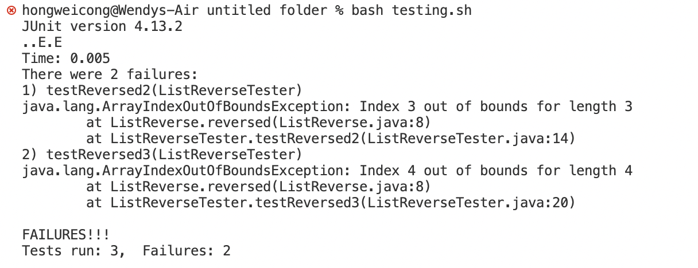
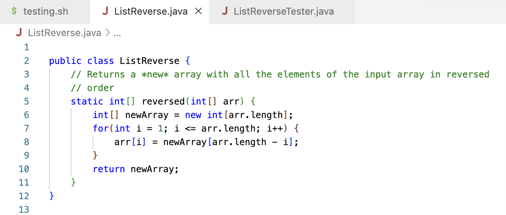
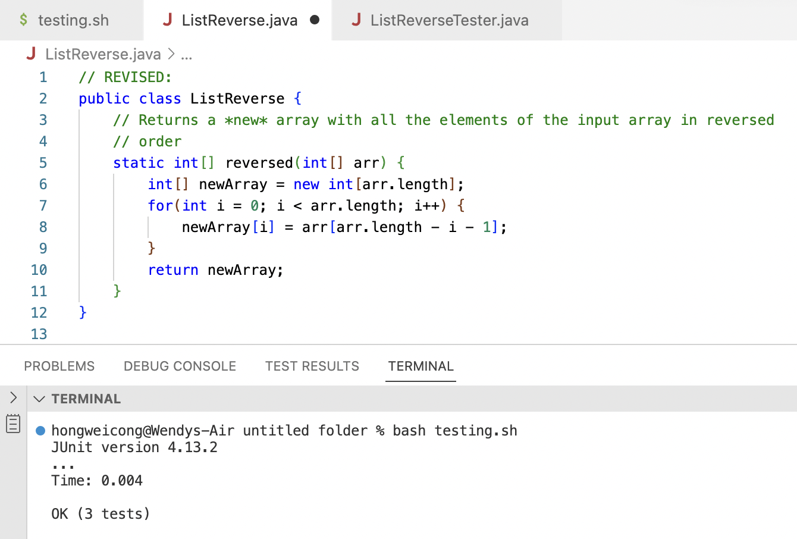

# CSE 15L Lab Report 5: Debugging Scenario & Reflection
In the first part of Lab Report 5, I am going to design a debugging scenario in the spirit and style of the ones from Week 9 Lab. As for the second part, I will reflect on my learning and experiences from lab activities in the second half of this quarter.
## Part 1.1: Debugging Scenario - Student's EdStem Post
- **Title**: Unexpected output & need help in debugging
- **Category**: Debugging
- **Post content**:

  **What environment are you using (computer, operating system, web browser, terminal/editor, and so on)?**
  
  I am using VSCode on MacOS system.
  
  **Detail the symptom you're seeing. Be specific; include both what you're seeing and what you expected to see instead. Screenshots are great, copy-pasted terminal output is also great. Avoid saying “it doesn't work”.**
  
  When I run my testing bash script (in which I wrote only two commands: `javac` and `java` to compile files and run the java program). In my terminal, I got output demonstrating 2/3 failures from the tester:
  
  It seems like the symptom of my bug is the IndexOutOfBoundsException.
  
  **Detail the failure-inducing input and context. That might mean any or all of the command you're running, a test case, command-line arguments, working directory, even the last few commands you ran. Do your best to provide as much context as you can.**
  
  I am aiming to set up a java class that contains a method `reversed` to reverse an array list by creating a new array list. Below is a screenshot of my code: 
  
  For my test case setup, I create a separate tester java file that contains several tests for the method `reversed`. For the input array list `{1, 2, 3}`, my expected output would be `{3, 2, 1}`; for the input array list `{0, 2, 4, 6}`, my expected output would be `{6, 4, 2, 0}`. However, I am getting IndexOutOfBoundsException as what is mentioned above. Could you please help me locate the bug? Thank you so much!
  
## Part 1.2: Debugging Scenario - TA's Responses
- **Title**: RE: Unexpected output & need help in debugging
- **Post content**:

  Hi, thanks for the detailed information provided. As for what I can see, I think you need to adjust the range for your For Loop. The logistic of copying the original array by iterating backward is correct, yet you should start from index 0 instead of index 1. That is, the range of your iteration should be from 0 to `arr.length-1` instead of 1 to `arr.length`. 
  
  Also, there is another minor mistake I detect from the provided code file. In line 8, you should set elements in `newArray` to the corresponding one in the input `arr` instead of changing elements from the input `arr`. Make sure to rectify this part as well. Keep in mind that with the range change in your For Loop, you might need to adjust the index used for updating `newArray`.
  
  Let me know if you have any further question. Good luck on debugging!

## Part 1.3: Debugging Scenario - Student's Code Revision Process
- **Title**: RE: Unexpected output & need help in debugging
- **Post content**:
  
  Thank you for your time and detailed explanation. I am now able to debug my program and compile the file with all tests passed!
  
  For my debugging process, I first changed the ranging method for the For Loop to `int i = 0; i < arr.length; i++` and swapped the position of `NewArray` and `arr` in line 8. Yet I got the same failure output as symptom from the terminal. Then I reviewed the indexing process with your advice and figured out that when iterating backward through the original array list `arr`, the index should be further minus 1 because of the zero-index rule. The revised line 8 is `newArray[i] = arr[arr.length - i - 1]`, and the program can pass the testing now.
  

## Part 1.4: Debugging Scenario - Setup Information
For the mock-up conversation between the student and TA on EdStem above, I created 2 Java files and 1 bash script. I utilized [lab 3](https://github.com/ucsd-cse15l-w23/lab3) and [lab 7](https://github.com/ucsd-cse15l-s23/lab7) from the course as reference sources to set up these files. The code blocks below would show a complete version of contents for each file respectively.
- ListReverse.java (*before* fixing the bug)
  ```
  public class ListReverse {
    // Returns a *new* array with all the elements of the input array in reversed
    // order
    static int[] reversed(int[] arr) {
        int[] newArray = new int[arr.length];
        for(int i = 1; i <= arr.length; i++) {
            arr[i] = newArray[arr.length - i];
        }
        return newArray;
    }
  }
  ```
- ListReverse.java (*after* fixing the bug)
  ```
  // REVISED:
  public class ListReverse {
    // Returns a *new* array with all the elements of the input array in reversed
    // order
    static int[] reversed(int[] arr) {
        int[] newArray = new int[arr.length];
        for(int i = 0; i < arr.length; i++) {
            newArray[i] = arr[arr.length - i - 1];
        }
        return newArray;
    }
  }
  ```
- ListReverseTester.java
  ```
  import static org.junit.Assert.*;
  import org.junit.*;

  public class ListReverseTester {
    @Test
    public void testReversed1() {
        int[] input1 = { };
        assertArrayEquals(new int[]{ }, ListReverse.reversed(input1));
    }

    @Test
    public void testReversed2() {
        int[] input1 = {1, 2, 3};
        assertArrayEquals(new int[]{3, 2, 1}, ListReverse.reversed(input1));
    }

    @Test
    public void testReversed3() {
        int[] input1 = {0, 2, 4, 6};
        assertArrayEquals(new int[]{6, 4, 2, 0}, ListReverse.reversed(input1));
    }
  }
  ```
- testing.sh
  ```
  javac -cp .:lib/hamcrest-core-1.3.jar:lib/junit-4.13.2.jar *.java
  java -cp .:lib/hamcrest-core-1.3.jar:lib/junit-4.13.2.jar org.junit.runner.JUnitCore ListReverseTester
  ```
## Part 2: Reflection
